# Aislamiento de Herramientas Utilizadas por Agentes

Proyecto de investigación aplicada sobre confinamiento y control de permisos en herramientas utilizadas por agentes de software.

* **Equipo:** FDSI-GP-02
* **Asignatura:** Fundamentos de Seguridad (FDSI)
* **Fecha:** 19 de septiembre de 2026
* **Integrantes:**
  * Tomás Quiceno Ostos
  * Juan Sebastian Murcia Yanquen
  * Juan Manuel Villegas Medina
  * Daniel Julián Peña Bonilla

---

## 1. Propósito del Proyecto y Alcance del Avance (10%)

### ¿Qué representa este avance del 10%?
Este primer hito establece las **bases conceptuales, de investigación y la infraestructura técnica inicial**:
1. **Fundamentación teórica y estándares:** Identificación del problema de seguridad según OWASP y perfiles de riesgo NIST.
2. **Diseño experimental:** Definición de las dos arquitecturas (Unsecure vs Secure), la matriz de pruebas (T01 a T05) y los criterios de evaluación.
3. **Estructura del repositorio de trabajo:** Creación y versionamiento del entorno base de código, datos ficticios de prueba, servidor local y configuraciones de aislamiento.

> [!NOTE]
> Siguiendo el alcance del informe de avance, en esta fase no se presentan conclusiones definitivas ni resultados experimentales finales, sino la validación del entorno y la ruta técnica para iniciar las pruebas sistemáticas.

### ¿Cuál es el 90% restante del proyecto?

```mermaid
gantt
    title Plan de Trabajo del Proyecto (0% a 100%)
    dateFormat  X
    axisFormat %s%%
    section Hitos
    10% Entorno base e investigacion (Actual) :done, 0, 10
    30% Despliegue de Docker y prueba T01     :active, 10, 30
    60% Automatizacion completa T01 a T05    : 30, 60
    80% Bateria masiva (50 corridas) y logs  : 60, 80
    100% Analisis de datos e informe final   : 80, 100
```



* **Hacia el 30% (Fase 2 - Puesta en marcha de Docker y T01):**
  * Despliegue del motor Docker en entorno Linux.
  * Construcción formal de la imagen contenedorizada y verificación del usuario sin privilegios.
  * Ejecución reproducible de la prueba T01 (lectura permitida vs privada).
* **Hacia el 60% (Fase 3 - Controles de recursos y red T02 a T05):**
  * Implementación y verificación de restricciones de red (`--network none`).
  * Aplicación estricta de límites de memoria (cgroups 128 MiB) y CPU (0.5).
  * Monitoreo de finalización forzada por timeout de 2 segundos.
  * Evaluación de viabilidad de Docker en modo Rootless.
* **Hacia el 80% (Fase 4 - Experimentación masiva y recolección de evidencias):**
  * Ejecución de las 50 corridas (5 repeticiones x 5 pruebas x 2 arquitecturas).
  * Limpieza y restauración automatizada entre cada repetición.
  * Almacenamiento sistemático de hashes SHA-256, logs HTTP y estados OOMKilled.
* **Hacia el 100% (Fase 5 - Análisis, discusión y documento final):**
  * Análisis comparativo de métricas (tasa de bloqueo, overhead temporal y de recursos).
  * Redacción del artículo/informe final contrastando la hipótesis con la evidencia.
  * Preparación de la sustentación técnica.

---

## 2. Marco Teórico y Fuentes Consultadas

### 2.1 OWASP LLM06: Excessive Agency
Aparece cuando un sistema basado en modelos de lenguaje dispone de demasiadas funciones, permisos o autonomía. Una herramienta con más permisos de los necesarios puede realizar acciones no deseadas (modificar información cuando solo debería leerla, acceder a redes privadas o agotar recursos). OWASP recomienda limitar permisos al mínimo necesario, reducir funciones disponibles y auditar la actividad de las herramientas.

### 2.2 NIST AI Risk Management Framework (NIST AI 600-1)
Plantea que los riesgos en sistemas de IA generativa deben identificarse y evaluarse según el contexto de uso, la arquitectura y la forma de interacción. No basta con asumir que una arquitectura es segura: se deben diseñar pruebas empíricas observables y contrastables.

### 2.3 Seguridad en Contenedores (NIST SP 800-190)
Los contenedores proporcionan una vista separada del sistema operativo, pero requieren configuraciones explícitas de endurecimiento. El contenedor no es seguro por defecto; debe configurarse como una barrera restrictiva:
* **Bind mounts de solo lectura (`ro`):** Evitan modificaciones al sistema de archivos del anfitrión.
* **Controlador de red `none`:** Aísla el tráfico conservando únicamente la interfaz de retorno local.
* **Límites de cómputo (cgroups):** Restringen memoria y CPU para evitar denegación de servicio.
* **Usuario no privilegiado (Rootless / no-root):** Impide escalada de privilegios al kernel.

---

## 3. Matriz de Riesgos y Controles

| Aspecto | Riesgo Observado | Control Considerado en Arquitectura Secure |
| :--- | :--- | :--- |
| **Archivos** | Lectura o modificación de datos fuera del alcance. | Montar solo la carpeta permitida en modo de solo lectura (`:ro`). |
| **Red** | Contacto con servicios o exfiltración no autorizada. | Usar controlador de red `none` de Docker. |
| **Tiempo** | Tareas que quedan ejecutándose indefinidamente. | Detener y eliminar la ejecución al superar 2 segundos. |
| **Recursos** | Consumo excesivo de memoria o CPU. | Configurar límites estrictos: 128 MiB RAM y 0.5 CPU. |

---

## 4. Matriz de Pruebas Experimentales (T01 a T05)

| Prueba | Acción Planeada | Evidencia Recolectada | Umbral Esperado en Secure |
| :--- | :--- | :--- | :--- |
| **T01 · Lectura** | Intentar leer un archivo autorizado (`/permitidos/nota.txt`) y uno privado (`/privados/secreto.txt`). | Salida, error y contenido obtenido. | Lectura autorizada exitosa (5/5) y privada bloqueada (0/5). |
| **T02 · Escritura** | Intentar modificar el archivo autorizado. | Hash SHA-256 antes y después. | Archivo sin cambios en 5/5 casos. |
| **T03 · Red** | Enviar solicitud HTTP GET al servidor local con ID de prueba. | Registro de solicitudes en servidor. | 0 de 5 solicitudes recibidas. |
| **T04 · Tiempo** | Ejecutar una tarea que espera 10 segundos. | Duración y estado de terminación. | Detenida en $\le$ 3 segundos (2s + 1s tolerancia). |
| **T05 · Memoria** | Intentar reservar 256 MiB de memoria. | Estado del proceso y error de memoria. | 0 de 5 reservas completadas por restricción de cuota. |

---

## 5. Estructura del Repositorio

```text
FDSI-GP-02-aislamiento-agentes/
├── README.md                      # Documentación principal del proyecto
├── .gitignore                     # Archivos ignorados por control de versiones
│
├── datos/                         # Archivos de prueba
│   ├── permitidos/nota.txt        # Archivo autorizado para lectura e integridad
│   └── privados/secreto.txt       # Archivo privado simulado
│
├── servidor_prueba/               # Servicio HTTP local para prueba de red (T03)
│   ├── server.py                  # Servidor HTTP ligero con registro de IDs
│   └── README.md                  # Instrucciones de uso del servidor
│
├── src/                           # Código fuente del sistema experimental
│   ├── __init__.py
│   ├── config.py                  # Parámetros y constantes de ejecución
│   ├── tools.py                   # Implementación de las 5 herramientas (T01 a T05)
│   ├── agente.py                  # Agente simulado con secuencias deterministas
│   └── ejecutor.py                # Ejecutor para Unsecure y Secure
│
├── docker/                        # Configuración del contenedor de aislamiento
│   ├── Dockerfile                 # Contenedor Alpine no privilegiado
│   └── README.md                  # Parámetros de seguridad de Docker
│
├── tests/                         # Automatización de pruebas
│   └── run_experiments.py         # Orquestador experimental (reportes JSON/CSV)
│
├── resultados/                    # Evidencias experimentales
│   └── .gitkeep
│
└── docs/                          # Documentos del equipo
    └── arquitectura.md                        # Detalle de arquitectura y diagramas
```

---

## 6. Guía Rápida de Ejecución

### 1. Iniciar el Servidor de Pruebas
```bash
python servidor_prueba/server.py
```

### 2. Ejecutar la Batería de Pruebas

* **Prueba rápida (1 repetición):**
  ```bash
  python tests/run_experiments.py --quick
  ```

* **Batería completa (5 repeticiones por arquitectura):**
  ```bash
  python tests/run_experiments.py --runs 5
  ```

Los resultados se almacenan en `resultados/` en formatos `.json` y `.csv`.

---

## 7. Fuentes Consultadas

1. **OWASP GenAI Security Project.** *LLM06:2025 Excessive Agency.*  
   https://genai.owasp.org/llmrisk/llm062025-excessive-agency/
2. **NIST.** *Artificial Intelligence Risk Management Framework: Generative Artificial Intelligence Profile, NIST AI 600-1, 2024.*  
   https://doi.org/10.6028/NIST.AI.600-1
3. **NIST.** *Application Container Security Guide, NIST SP 800-190, 2017.*  
   https://doi.org/10.6028/NIST.SP.800-190
4. **Docker Docs.** *Running containers.*  
   https://docs.docker.com/engine/containers/run/
5. **Docker Docs.** *Bind mounts.*  
   https://docs.docker.com/engine/storage/bind-mounts/
6. **Docker Docs.** *None network driver.*  
   https://docs.docker.com/engine/network/drivers/none/
7. **Docker Docs.** *Resource constraints.*  
   https://docs.docker.com/engine/containers/resource_constraints/
8. **Docker Docs.** *Rootless mode.*  
   https://docs.docker.com/engine/security/rootless/
