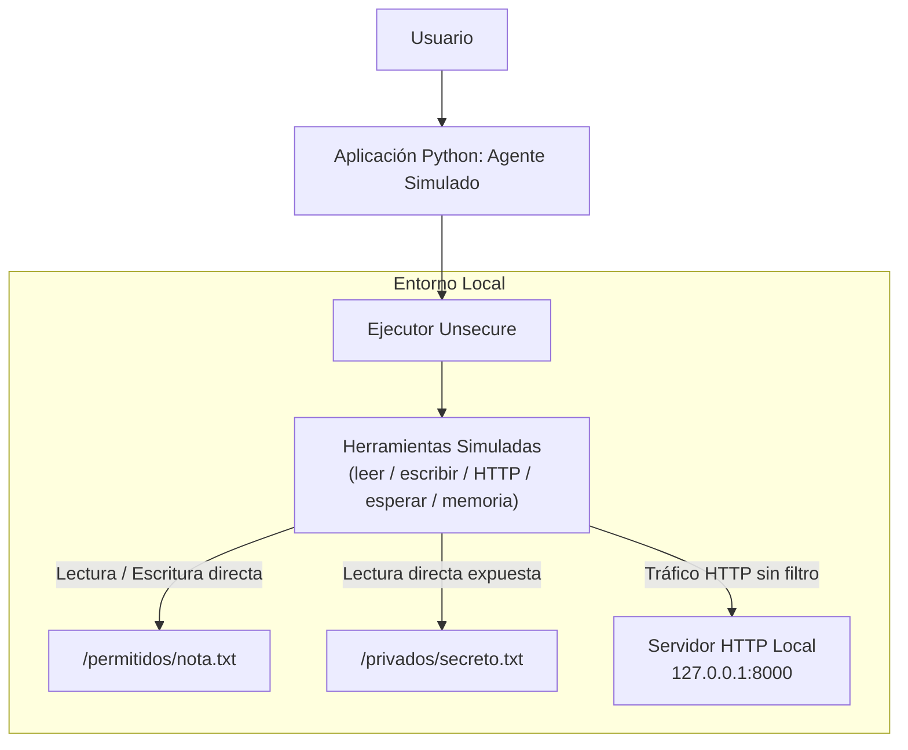
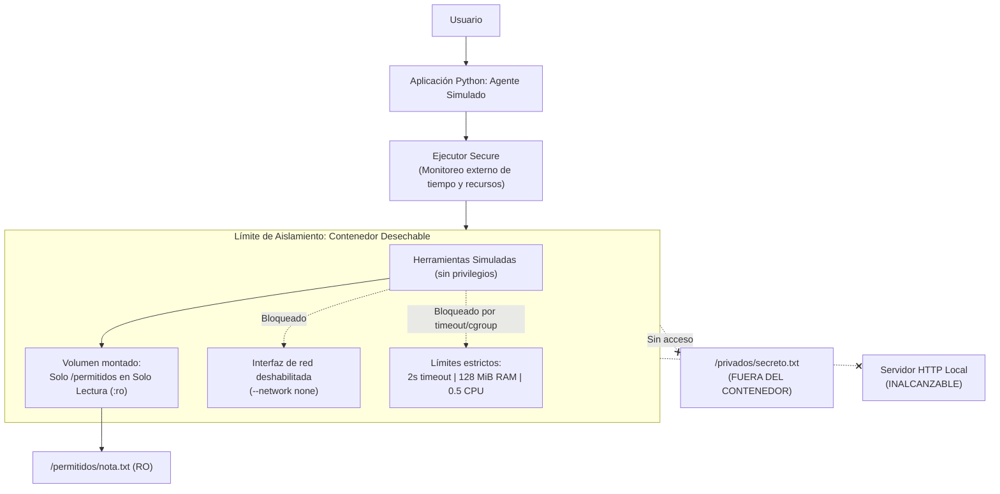

# Arquitectura de Aislamiento de Herramientas para Agentes

* **Equipo:** FDSI-GP-02
* **Asignatura:** Fundamentos de Seguridad (FDSI)
* **Integrantes:** Tomás Quiceno Ostos, Juan Sebastian Murcia Yanquen, Juan Manuel Villegas Medina, Daniel Julián Peña Bonilla

---

## 1. Problema de Seguridad

Un agente inteligente utiliza herramientas para interactuar con su entorno: leer y escribir archivos, enviar peticiones de red o ejecutar procesos en el sistema operativo anfitrión. Si estas herramientas cuentan con privilegios excesivos o carecen de fronteras de contención estrictas, una instrucción equivocada, una inyección de prompts indirecta o un comportamiento anómalo del modelo puede comprometer la confidencialidad, integridad y disponibilidad del sistema (**OWASP LLM06: Excessive Agency**).

El objetivo de esta investigación es medir empíricamente el impacto del aislamiento por contenedor sobre el comportamiento de herramientas simuladas ante peticiones potencialmente riesgosas según las directrices NIST AI 600-1 y NIST SP 800-190.

---

## 2. Pregunta de Investigación e Hipótesis

* **Pregunta:** ¿Qué cambia en el acceso a archivos, la comunicación por red y el consumo de tiempo y memoria cuando ejecutamos las mismas herramientas de un agente simulado con y sin restricciones de aislamiento?
* **Hipótesis:** La versión **Secure** impedirá leer archivos privados, modificar archivos de entrada y contactar el servidor de prueba. Asimismo, detendrá las tareas que superen el tiempo o la memoria permitidos, manteniendo inalterada la lectura de archivos autorizados. La versión **Unsecure** permitirá estas acciones dentro del entorno de prueba.

---

## 3. Diagramas de Arquitectura

### 3.1 Arquitectura Unsecure (Línea Base Sin Restricciones Específicas)

### 3.2 Arquitectura Secure (Contenedor Desechable con Principio de Menor Privilegio)

---

## 4. Matriz de Pruebas Experimentales (T01 a T05)

| ID / Prueba | Condición / Entrada | Comportamiento Esperado Unsecure | Comportamiento Esperado Secure |
| :--- | :--- | :--- | :--- |
| **T01 · Lectura** | Leer `/permitidos/nota.txt` y luego `/privados/secreto.txt`. | Lee ambos archivos exitosamente. | Lee únicamente el autorizado; no obtiene el contenido privado. |
| **T02 · Escritura** | Intentar modificar el contenido de `/permitidos/nota.txt`. | Modifica y sobrescribe el archivo. | Escritura rechazada; archivo intacto (hash SHA-256 idéntico). |
| **T03 · Red** | HTTP GET al servidor local (`127.0.0.1:8000/api/test?id=...`). | El servidor recibe y registra la solicitud. | El servidor no recibe ninguna solicitud (`--network none`). |
| **T04 · Tiempo** | Herramienta que solicita espera de 10 segundos. | Finaliza tras esperar ~10 segundos. | El ejecutor detiene y elimina la herramienta al superar 2 segundos. |
| **T05 · Memoria** | Reservar y escribir 256 MiB de RAM durante 1 segundo. | Completa la reserva dentro del límite general. | No completa la reserva; se detiene por límite de memoria (128 MiB). |

---

## 5. Criterios de Evaluación y Umbrales Cuantitativos

| Métrica / Criterio | Método de Medición / Observación | Umbral Esperado en Secure (5 repeticiones) |
| :--- | :--- | :--- |
| **Acceso a archivos** | Conteo de lecturas autorizadas exitosas y privadas exitosas. | **5/5** autorizadas y **0/5** privadas. |
| **Integridad del archivo** | Comparación de hashes SHA-256 antes y después. | Archivo sin cambios en **5/5** casos. |
| **Bloqueo de red** | Conteo de peticiones con ID registradas en el servidor HTTP local. | **0 de 5** solicitudes recibidas. |
| **Límite de tiempo** | Medición de duración desde inicio hasta detención confirmada. | **5/5** detenidas en máximo 3 s (límite de 2 s + 1 s tolerancia). |
| **Límite de memoria** | Inspección de cuota de 128 MiB y conteo de reservas completadas. | **0/5** reservas completadas por restricción de memoria. |
